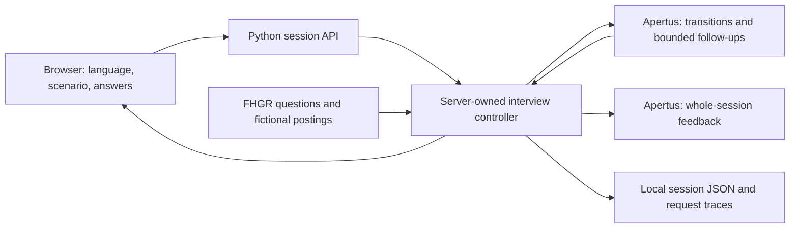

# AI-Powered Job Interview Coach

An Apertus-based interview practice app for teenagers preparing for their first job or apprenticeship. Built for HackApertus 2026, Track 2A — FHGR.

**Status:** Runnable Docker web prototype with a complete interview controller and multilingual final feedback. Development simulations cover all 28 organiser scenarios. Coaching quality has known limitations; the official benchmark and consumer-hardware VRAM validation remain outstanding.

## Features

- English, German, French and Italian interface and coaching instructions.
- A thirteen-question browser interview covering introduction, motivation, strengths/weaknesses, situational questions, candidate questions and closing, followed by feedback.
- Questions selected from the supplied FHGR bank, with at most one follow-up per eligible main question.
- Early recap, feedback across eleven criteria and conversation downloads.
- A neutral answer placeholder with optional help. The current controller does not generate contextual hints; the interface uses its translated fallback guidance.
- Responsive desktop/mobile layouts and demo mode without model calls.
- Voice adapter hooks: ordered speech output and confirmed-transcript input; actual audio services are not included.

The scenario dropdown offers IT, retail, hospitality, technical and first-job practice labels. Currently all options use an apprenticeship question plan and a fictional apprenticeship posting; the first-job option does not yet have a dedicated non-apprenticeship flow.

## Quick start

Install and start Docker Desktop or a compatible Docker engine. From the repository root:

```sh
make -C track_2a web-demo
```

Open **http://localhost:8080**. Demo mode advances through bank questions and ends with fixed example feedback; it provides no personalised AI coaching. Stop with Ctrl+C.

For Apertus, create the ignored `track_2a/data/.env` file:

```dotenv
LLM_API_KEY=your-key
LLM_BASE_URL=https://your-provider.example/v1
LLM_NAME=swiss-ai/Apertus-v1.5-8B
```

Use the model identifier and API base URL accepted by your serving endpoint. Then run:

```sh
make -C track_2a web
```

`make run` is an alias for the web app. See the [implementation README](track_2a/README.md) for deployment and local Python instructions. The Docker image contains the application and public runtime resources; Apertus weights and model serving are separate.

## Architecture and visual overview



Code controls stages, question subtypes, topic coverage, counts and termination. Apertus supplies transitions, company answers and permitted follow-ups. German/French/Italian main-question wording is retained from the bank; English wording is less constrained. Small talk receives a brief code-controlled acknowledgement. Feedback is produced at recap, rather than forcing a strength and improvement after every answer.

One normal answer makes one interviewer request, with at most one validation correction. Completing the plan also triggers a feedback request; requesting early recap goes directly to feedback. A feedback request permits one correction. JSON validation and exact evidence checks do not guarantee truthful interpretation. No judge or candidate simulator runs in the live app.

For future voice support, responses expose language-tagged speech segments and turn IDs. Browser events support playback cancellation and recognised text as an editable answer draft. No microphone or audio playback is enabled; model responses arrive in full rather than streaming. See the [voice integration contract](track_2a/README.md#voice-integration-contract).

Sessions are owned and saved by the server. The browser keeps a display copy and sends a session ID, revision and answer. Refresh starts a new session; login and share links are not implemented. API credentials remain server-side. In AI mode, answers go to the configured model provider.

## Development and evaluation

Python 3.12 is the Docker runtime. No third-party Python packages or frontend build tools are required.

```sh
conda env create -f environment.yml
conda activate apertus-interview-coach
cd track_2a
make test
python src/web.py --provider demo
```

All 33 application tests pass. The latest development run completed 28 simulated interviews in German, French and Italian: 417 candidate answers and 471 coach calls, averaging 1.13 calls per answer. Candidate answers were generated separately by Apertus from fictional scenario profiles; these are not human interviews. Assistant-authored whole-session review labels remain drafts awaiting validation.

The challenge weights performance at 50%, consistency at 25% and innovation at 25%, with practicality as a required gate. Recorded call efficiency is below five calls per answer, but hosted inference does not establish operation below 32 GB VRAM. Grounding, candidate-question handling, repetition and follow-up selection remain weaknesses. See the [technical report](track_2a/technical_report.md) for measurements, review findings and limitations.

## Repository

| Path | Purpose |
| --- | --- |
| [track_2a/README.md](track_2a/README.md) | Setup, deployment and session behaviour |
| `track_2a/src/` | Web server, controller, model clients, prompts, interface and tests |
| `track_2a/data/interview/` | Public runtime questions, fictional postings, rubric and guidelines |
| `track_2a/Makefile` | Web launch and test commands |
| [track_2a/technical_report.md](track_2a/technical_report.md) | Approach, visual architecture and development results |
| `environment.yml` | Optional Conda environment |

Credentials, sessions, experimental tooling, generated runs and manual-review labels remain local and are excluded from the published application. The local review interface is not a submission dependency.

## License

See [LICENSE](LICENSE). Bundled organiser resources retain their upstream attribution and usage conditions; see [data provenance](track_2a/data/interview/README.md).
