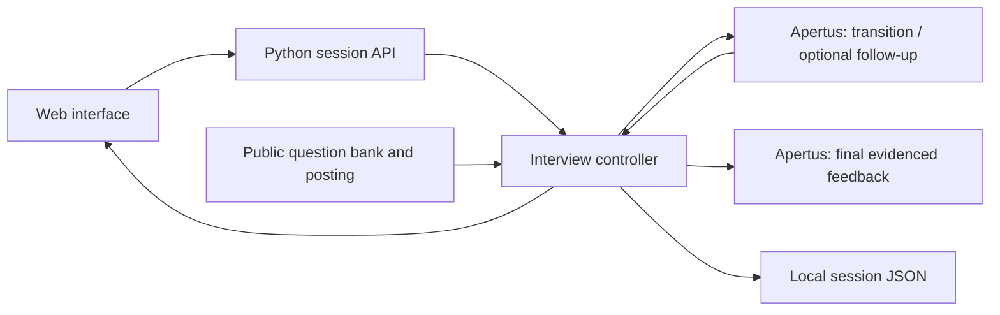

# Interview Coach — Implementation

See the [project overview](../README.md) for the audience, scope, and challenge requirements.

## Docker setup

Start Docker Desktop or a compatible Docker engine. From this directory:

```sh
make web-demo
```

Open **http://localhost:8080**. Stop with Ctrl+C. Demo mode uses fixed example feedback and makes no AI calls.

For personalised coaching, create `data/.env` locally:

```sh
mkdir -p data
```

Add your provider configuration to that file:

```dotenv
LLM_API_KEY=your-key
LLM_BASE_URL=https://your-provider.example/v1
LLM_NAME=your-apertus-model-id
```

Use the provider's actual API base URL, including its API prefix. The server appends `/chat/completions`. Use HTTPS for remote authenticated endpoints. The `.env` file is ignored by Git.

Launch the coach:

```sh
make web
```

`make run` also launches the web app. The launcher loads `data/.env`, builds the image, and binds the published port to loopback. It detects Docker Desktop's bundled CLI on macOS and reports when the engine is unavailable.

## Other launch options

Change the host port:

```sh
make web-demo WEB_PORT=8082
```

For development with an already-installed model served by Ollama on the host:

```sh
make web COACH_PROVIDER=ollama COACH_MODEL=llama3:8b
```

The container reaches host Ollama through `host.docker.internal:11434`. Set `DOCKER_OLLAMA_BASE_URL` to override it. This development model is not the final Apertus submission.

The legacy stateless API accepts a reviewed prompt profile supplied with `PROFILE=data/profiles/name.json`. Profiles are local JSON files and do not override the new session controller prompts; the application uses the small `prompt_profile.py` loader, without depending on the local human-review tool.

Without Docker, use Python 3.12 and run:

```sh
python src/web.py --provider demo
```

For direct Apertus use, export the provider variables in your shell first, then use `--provider apertus`. For direct Ollama use, use `--provider ollama --model llama3:8b`; its default endpoint is `http://127.0.0.1:11434`. No third-party Python packages are required.

## Architecture and session flow



The server chooses a bank-question plan and owns stage, subtype, topic coverage and counters. Each answer triggers one interview request; code validates the response and either permits one follow-up or advances the plan. Finishing the plan or requesting recap triggers a separate whole-session feedback request. The same configured model handles both tasks; no judge is part of the live interview.

Current prompts are the German, French and Italian `src/prompts/session/interviewer.<language>.txt` and `feedback.<language>.txt`; English retains `interviewer.txt` and `feedback.txt`. `guidance.<language>.json` supplies translated rubric/feedback rules, while `instructions.json` localises controller reminders and corrections. The controller supplies public company facts, question metadata, state and actual dialogue. Final feedback also receives the public eleven-criterion rubric and feedback guidelines. Simulator personas, reference annotations and scenario success criteria are excluded from coach input. Older `prompts/web/` are retained only for the legacy stateless API.

## Data and privacy

Server-owned sessions, transcripts and request traces are persisted locally in ignored `data/sessions/`. The browser currently starts a fresh session on refresh; persisted sessions are not a login or share-link feature. Clear local session files when no longer needed. Answers are sent to the configured model provider. API keys remain server-side and model text is rendered as text, not HTML.

The bundled server is intended for local use. Public authenticated hosting needs additional deployment work. Public runtime resources are in `data/interview/`; experimental tools and generated runs remain Git-ignored.

## Tests and development results

From this directory, run:

```sh
make test
```

All 30 application tests pass. They cover progression bounds, conditional question selection, language-specific prompts, evidence validation, server-owned revisions/persistence and the retained legacy API. Model responses are mocked in these tests; passing tests does not establish coaching quality.

The latest local development run completed all 28 organiser scenarios with a separate Apertus candidate simulator. It recorded 417 candidate answers and 471 coach calls, including corrections and final feedback: 1.13 calls per answer. Whole-session assistant reviews are drafts awaiting user validation. Language consistency improved, while grounding, candidate-question handling and follow-up selection remain weak. See [technical_report.md](technical_report.md) for details.

Simulation/evaluation tools, generated runs and manual-review data are deliberately Git-ignored. A fresh clone includes the application, public runtime resources and application tests, but not those local experiments. Commands for private experiment scripts are therefore not part of the submission deployment instructions.

## Session behaviour and limits

Browser sessions start through `/api/session/start`. Clients send a session ID, revision and answer to `/api/answer` or `/api/recap`. Code stores the question plan, current stage/subtype, covered topics, main-question/follow-up counts, transcript and request traces. It updates stage context as the interview progresses.

The browser plan has thirteen main questions, including interview closing, followed by feedback across all eleven FHGR criteria. Each eligible main question permits at most one follow-up; small talk, candidate questions and closing do not. Completing the plan triggers final feedback automatically. Recap ends early and asks the model to acknowledge unavailable evidence. An unsent answer can be included when requesting recap.

The displayed answer ceiling is a conservative bound of twice the plan length (26); eligible-question restrictions make the actual maximum smaller. `MAX_ANSWERS` and `--max-answers` belong to the retained stateless API and do not change the browser controller's plan. The controller currently returns no generated hint, so the interface uses its translated fallback guidance. The first-job scenario label currently selects an apprenticeship posting and the same question plan, rather than a separate first-job interview.

One normal turn makes one model call, with at most one validation correction. The final answer can also trigger a feedback task with up to two calls. Early recap makes only the feedback task. Invalid German/French/Italian interviewer output can fall back to the next bank question after two attempts; invalid English interviewer output and failed feedback are reported as errors. User retries after transport failures can add calls and must be counted. No live judge is used.

## Docker packaging and practicality

`src/run.sh` copies the versioned public resources from `data/interview/` into ignored `src/interview_data/` before building. The image bundles the Python runtime, application, static interface, prompts and these resources. It excludes credentials, experiments, simulation profiles, annotations and generated outputs. Session files persist in the host's ignored `data/sessions/` directory through a bind mount. Run `make web` or `make web-demo` to prepare the build context; a bare Docker build from a fresh clone lacks the staged resource directory.

The image is an application client; it does not install or serve Apertus weights. Hosted inference does not verify the under-32-GB VRAM requirement. A consumer-hardware Apertus deployment, quantisation/context settings and measured memory usage remain outstanding. The recorded hosted development run meets the call-efficiency threshold, but does not establish the complete practicality gate.

## Local manual review (not included in a fresh clone)

The developer's local portal runs on port 8081 and groups individual-answer v1/v2 and whole-interview v5/v6. It preserves each version's labels separately, displays category summaries and draft/validated status, and links exact coach evidence to guideline notes. Originals are expanded by default, with collapsible AI-assisted English reading aids underneath. Both complete-interview versions now have cached English transcript translations; originals remain authoritative.

The portal and its data remain under ignored `src/experiments/` and `data/manual_review/`. The local `make review` target requires those files and is not a supported command for a clean submission checkout. The previous individual review servers have been replaced by this single portal.
