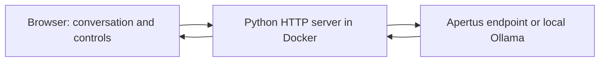

# Interview Coach — Implementation

See the [project overview](../README.md) for the audience, scope, and challenge requirements.

## Docker setup

Start Docker Desktop or a compatible Docker engine. From this directory:

```sh
make web-demo
```

Open **http://localhost:8080**. Stop with Ctrl+C. Demo mode uses fixed example feedback and makes no AI calls.

For personalised coaching, create `data/.env` locally:

```sh
mkdir -p data
```

Add your provider configuration to that file:

```dotenv
LLM_API_KEY=your-key
LLM_BASE_URL=https://your-provider.example/v1
LLM_NAME=your-apertus-model-id
```

Use the provider's actual API base URL, including its API prefix. The server appends `/chat/completions`. Use HTTPS for remote authenticated endpoints. The `.env` file is ignored by Git.

Launch the coach:

```sh
make web
```

`make run` also launches the web app. The launcher loads `data/.env`, builds the image, and binds the published port to loopback. It detects Docker Desktop's bundled CLI on macOS and reports when the engine is unavailable.

## Other launch options

Change the host port:

```sh
make web-demo WEB_PORT=8082
```

For development with an already-installed model served by Ollama on the host:

```sh
make web COACH_PROVIDER=ollama COACH_MODEL=llama3:8b
```

The container reaches host Ollama through `host.docker.internal:11434`. Set `DOCKER_OLLAMA_BASE_URL` to override it. This development model is not the final Apertus submission.

A reviewed prompt profile can be supplied with `PROFILE=data/profiles/name.json`. Profiles are local JSON files; the application uses the small `prompt_profile.py` loader, without depending on the local human-review tool.

Without Docker, use Python 3.12 and run:

```sh
python src/web.py --provider demo
```

For direct Apertus use, export the provider variables in your shell first, then use `--provider apertus`. For direct Ollama use, use `--provider ollama --model llama3:8b`; its default endpoint is `http://127.0.0.1:11434`. No third-party Python packages are required.

## Architecture and session flow



`src/web.py` serves the static interface and validates language, scenario, transcript roles, and message lengths. `src/experiment.py` contains the provider adapters and separate batch evaluation workflow. The image contains neither the local review tool nor the terminal app.

| Stage | Behaviour | Model calls |
| --- | --- | --- |
| Select language/scenario | Display a translated, prepared opening and optional motivation hint | 0 |
| First answer | Strength, improvement, adaptive question, and a matching hint | 1 |
| Second answer | Feedback and another adaptive question using the conversation so far | 1 |
| Third answer | Personalised recap and a next practice step | 1 |
| Download/restart | Export text locally or clear the conversation | 0 |

The coach is asked to accept school, hobby, and home examples, avoid fabricated achievements, and avoid personality or employability judgments. Response JSON contains `reply` and `hint`; missing hints or plain-text replies receive neutral fallback guidance without another model call. Demo follow-ups and hints are fixed examples across scenarios. Changing language or scenario restarts practice, with confirmation if answers or a draft exist.

## Data and privacy

The web conversation lives in tab memory and is lost on refresh or restart unless downloaded. The server does not save web transcripts to disk. Answers are sent to the configured model provider, whose retention policy applies. Avoid personal details. There is no login, session database, or shareable conversation link.

The bundled server is intended for local use; authenticated public hosting would require additional deployment work. API keys remain server-side, and model output is displayed as text rather than HTML.

## Tests and batch evaluation

Run tests in a Python environment:

```sh
make test
```

The batch experiment uses four authored English example cases in `data/first_interview_en.json`, not an official benchmark. To generate sample responses and evaluate the coach with a host Ollama judge:

```sh
mkdir -p data/runs
python src/experiment.py generate --provider sample --output data/runs/sample.json
python src/experiment.py evaluate --input data/runs/sample.json --output data/runs/sample_judged.json
```

Ollama must have the judge model installed; the default is `qwen3.5:9b`. Output paths must be new. Judge reports include scores, explanations, and evidence. Invalid judgments are saved for review and excluded from averages. Judging remains separate from browser practice and does not score candidate ability.

## Practicality and limitations

The web app uses three model calls per completed session and adds no model weights or GPU requirement. The selected Apertus model, quantisation, context length, and serving configuration still require verification against the under-32-GB VRAM gate. Interface translations do not establish multilingual coaching quality; model responses, feedback usefulness, learning gains, and consistency require further evaluation.

See [technical_report.md](technical_report.md) for the technical report.
