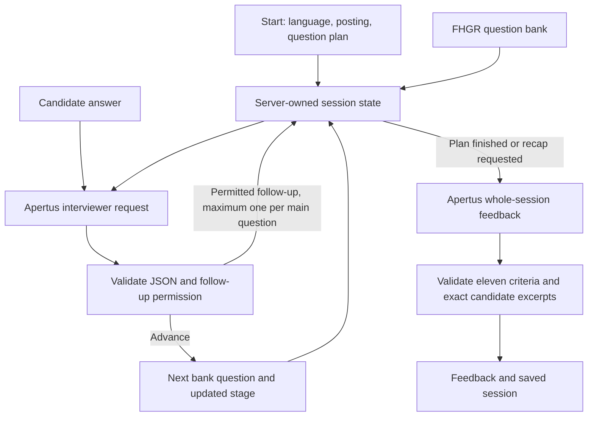

# Interview Coach — technical report

**Track 2A** — `FHGR` 
**Team:** `Next Question` -- `Alisa Smirnova`
**Demo:** TBD

## Approach and architecture

The application runs an apprenticeship practice interview from opening to closing, followed by coaching feedback. A deterministic Python controller owns progression; Apertus provides conversational transitions, company answers and optional follow-ups. This separates interview coverage and termination from generative decisions.

`src/interview_controller.py` stores current stage, question subtype, covered stage/subtopic pairs, main-question count, total/current follow-up count, answers, transcript, completion state and request traces. Coverage means a topic was asked/answered, not that the answer demonstrated competence. Conditional bank questions are selected only when the supplied dossier establishes eligibility. The default browser plan contains thirteen main questions; organiser scenarios use their own ten-to-seventeen-question plans, including phone, trial and assessment formats. Recap can end early.

`src/web.py` provides session start, answer and recap APIs. A session ID and answer revision prevent clients from replacing server-owned dialogue or submitting stale answers. Atomic JSON replacement persists sessions locally. The current browser does not resume a persisted session after refresh. A server-wide lock serialises session mutations; this is acceptable for a local prototype but limits concurrent use.

## Models and prompt construction

Development inference used `swiss-ai/Apertus-v1.5-8B` through the configured CSCS endpoint. Credentials live in ignored `data/.env`; never bundle them in the image.

1. Opening: code selects the first bank question; no LLM request.
2. Candidate answer: `prompts/session/interviewer.<language>.txt` (unsuffixed for English) plus language, public posting, current/next bank questions, subtype/stage, counters and actual dialogue. Apertus returns acknowledgement, proposed question, follow-up decision and reason in constrained JSON. Code permits at most one follow-up per substantive main question; none for small talk, candidate questions or closing.
3. Main-question progression: German/French/Italian bank wording is retained exactly. Pilot model adaptations drifted away from selected questions, so unrestricted rewording is deliberately deferred. Apertus still controls transitions and permitted follow-up wording. The default thirteen English questions have explicit translations, but English adaptation remains less protected and was not evaluated in the supplied scenarios.
4. Final recap: `prompts/session/feedback.<language>.txt` (unsuffixed for English), compact public eleven-criterion rubric, feedback guidelines and the whole actual transcript. An enumerated list of candidate excerpts constrains evidence quotes. All eleven criterion keys are required; an unsupported score without a quote is withheld. Quote presence does not prove the assessment is logically supported.

Each task permits one correction attempt. After two invalid German/French/Italian interviewer responses, code can advance using a neutral acknowledgement and the bank question. Invalid English interviewer output is reported as an error. Failed feedback is reported rather than fabricated. Transport failures remain retryable errors. No judge or candidate simulator is used in the live app.

Public resources are in `data/interview/`, copied from the organiser repository with provenance/hashes. No reference annotations are used by the controller. Hidden candidate simulation personas and scenario evaluation hooks are provided only to experimental simulation code, never to the interviewer. Docker bundles the runtime and public resources; generated results and experimental tooling are excluded.

## Earlier full-session development evaluation (v5)

All 28 organiser scenarios were completed with a separate Apertus candidate simulator: 20 German, 5 French and 3 Italian interviews. The simulator uses fictional profiles/personas and answers the interviewer; its calls are test overhead. Scenario READMEs and interview-flow documentation informed format-specific plans and conditional selection.

The earlier aggregate is `data/runs/full-interviews-v5/`. Successful checkpoints from preceding development versions were reused after fixing simulator roles, topic drift and output-validation failures. Exact prompts, raw model responses and errors are preserved per case; this aggregate is a development smoke run across revisions, not a clean fixed-version benchmark or a baseline comparison.

| Measure | Result |
| --- | ---: |
| Completed scenarios | 28/28 |
| Candidate answers | 416 |
| Coach requests, including recorded retries and feedback | 488 |
| Coach requests per answer | 1.17 |
| Highest session average | 1.44 |
| Candidate-simulator requests | 416 |
| Main questions per interview | 10–17 |
| Adaptive follow-ups requested | 0 |

One final-run checkpoint records a deterministic bank fallback after truncated interviewer output. Earlier attempt errors remain in request traces. Completion does not imply useful adaptation: zero follow-ups is a significant failure despite implemented bounds.

The coding assistant inspected complete coach conversations and authored draft labels against all 26 rules in the current guideline file (including the multilingual addition S4). No LLM judge produced these labels. They are provisional and require Alisa's validation. Review units are whole sessions, with “Not applicable” for absent triggers and “Not sure” for ambiguous interpretation. The review distinguishes candidate-visible feedback from internal evidence fields.

| Draft finding | Sessions |
| --- | ---: |
| K3: at least one unsupported/invented assessment or detail | 28/28 |
| K1: some delivered feedback lacks a concrete reference | 28/28 |
| S4: substantial feedback in the wrong language | 19/28 |
| A1: final closing omits explicit practice framing | 17/28 |

These historical counts are assistant-authored draft findings, not validated performance scores. Some evidence interpretations need correction: P-08 explicitly permits third-year learners to lead a residential group for two weeks. The earlier contrary criticism must not be treated as a verified violation. Tone remains respectful across all reviewed sessions. Other recurring problems include unanswered candidate questions, repeated acknowledgements, unnecessary improvement advice and employer-role promises. A self-doubt scenario needs validation of whether the generic acknowledgement is sufficient; the candidate already proposes speaking with a teacher/career adviser.

## Limitations and next priorities

The submission is a functional prototype with known coaching-quality limitations. Constrained JSON and literal quote checks cannot prevent false inferences. Company answers invent schedules, communication tools and even contact details; these should be generated from selected facts with explicit unknown handling. The earlier run often switched final output to English; localised instructions eliminated substantial switches in the latest development run. Internal quotes are currently omitted from the delivered recap; the UI must display evidence alongside concise feedback. Follow-up selection needs targeted examples and separate checks on genuinely weak answers.

The simulator sometimes produces unrealistically polished answers, dialect despite a Standard German instruction, or reverses roles (S-28). Assessment/group-task scenarios are dialogue approximations, not execution of the real tasks. English interviews, human learning outcomes, repeatability and the organisers' hidden LLM-as-judge benchmark are unmeasured.

The recorded coach-call average is below the fewer-than-five threshold in this hosted run. Local consumer-grade deployment below 32 GB VRAM has not been measured; the Docker image is the application client, not an included model-serving stack. Quantised Apertus serving and memory/context measurements remain required before claiming that gate.

## Reproduction and review

See `README.md` for Docker and environment setup. `make run` builds and starts the web application. Public deployment resources remain in Git; local experimental tools live under ignored `src/experiments/` and generated runs under ignored `data/runs/`.

The public checkout supports `make web-demo`, configured Apertus `make web`, and `make test` from `track_2a`. Experimental scenario runners and review tools are intentionally excluded from Git, so the reported development runs cannot be reproduced using only a fresh submission checkout. The supplied organiser data and local scripts were used during development; no local-path experiment commands are required for deployment.

Validation: 33 application tests pass, including progression bounds, conditional questions, hidden-persona exclusion, exact evidence rejection and early recap. These use mocked model responses. The initial image built and started successfully. After subsequent controller/API refinements, a rebuild encountered a Docker Hub HTTP 500; those refinements were smoke-tested in the existing image using read-only source mounts. A fresh end-to-end build of the final submitted image remains to be verified. Documentation updates do not constitute a new Docker verification. Local VRAM feasibility is outstanding.

## Instruction localisation and fresh development run (v6)

German, French and Italian sessions now use translated interviewer/feedback instructions, controller task reminders, correction requests, rubric meanings/score anchors and all feedback guidelines. Original English prompts are preserved for English sessions. Technical schema keys and IDs remain unchanged. The controller includes only the selected-language question text; original company facts and candidate excerpts are not translated. French/Italian coaching-guidance translations require review.

This change adds no decomposition calls and leaves progression, retry limits and scoring rules unchanged. A fresh run in `data/runs/full-interviews-v6-localized/` completed all 28 scenarios with `swiss-ai/Apertus-v1.5-8B`. Coach instructions/controller stayed fixed; prompt snapshots, hashes, raw outputs and request traces are retained. SHA-256 checks confirm old v5 results and review artifacts were not changed.

| Latest-run measure | Result |
| --- | ---: |
| Completed scenarios | 28/28 |
| Candidate answers | 417 |
| Coach calls, including corrections and final feedback | 471 |
| Coach calls per answer / highest session average | 1.13 / 1.20 |
| Simulator calls, including two failed attempts | 419 |
| Adaptive follow-ups | 1, repeating an already answered question |
| Deterministic role-play-ending fallbacks | 25 |
| Final scores withheld for missing evidence | 1 |

Manual assistant reviews cover each complete interview against the same 26 guideline rules, with notes and exact coach quotations or explanations for missing elements. All 28 are saved as drafts for user validation. Draft counts: K1 28 violations; K3 20 violations, 7 uncertain, 1 meets; E3 6 violations; K2 4 violations; S3 4 violations; A1 3 violations; S4 no violations. Tone remains respectful. Original transcripts are shown alongside company facts and separately identified internal evidence; cached AI-assisted English translations are now available for all turns in both full-interview versions. Translations are reading aids and have not been independently verified.

Language consistency and practice framing look better than v5. Grounding, response to candidate questions, repetition and adaptation remain serious problems. For example, S-20 invents eye contact from text, S-25 penalises difficult-question performance without asking a difficult question, and S-07 unnecessarily penalises dialect. Internal exact quotes are still omitted from candidate-visible feedback. Most individual sentences are short; long repetitive paragraphs are a distinct readability problem.

This is a development simulation, not a fixed-input causal benchmark or a validated performance score. Candidate answers vary from v5, which itself contains mixed revisions. In S-03, two truncated simulator responses required resuming only that scenario with a longer simulator token budget and a shorter-answer instruction; coach prompts were unchanged. Hosted inference still does not verify local VRAM feasibility.

## Current manual-review workflow

One local portal on port 8081 now contains individual-answer v1/v2 and complete-interview v5/v6; the earlier separate review servers were stopped. Each version keeps its own labels. Original text is expanded by default and English reading aids are collapsed below it; either can be toggled independently. Saved version-wide category counts and per-example findings distinguish violations, uncertainty and validation status. Exact coach evidence is highlighted in the original text and links to the relevant guideline, with a return link to the passage.

Both full-interview versions have cached translations for all 56 interviews (888 v5 turns and 890 v6 turns), matched to the source sample and individual turn hashes. Translations are AI-assisted and not independently verified; source text remains authoritative. The ten original individual-answer labels were validated by Alisa; stage-aware individual-answer and complete-interview labels remain drafts. This review portal is local experimental tooling, not included in the submission image or required to run the coach.

## Submission scope and remaining validation

The versioned submission includes the controller, multilingual prompts, public runtime resources, web interface, model client, Docker packaging, deployment instructions and tests. This report and the project README contain a visual architecture overview. Generated transcripts, review labels, translation caches, credentials and experimental scripts remain local.

The image depends on a separately served Apertus model. Official benchmark scoring, repeatability/consistency measurements, human learning outcomes and local VRAM measurement are not available. The reported 1.13 coach calls per answer is a recorded development-run average, not a guarantee for unlimited user retries. The work is submitted as a prototype with these limitations disclosed.

## Voice readiness

`src/voice.py` is a dependency-free boundary between delivered coach text and a future speech adapter. Controlled APIs attach a versioned speech envelope containing session/turn IDs, a BCP-47 language tag and ordered chunks of at most 240 characters. Segmentation does not change prompts, progression, candidate-visible text or coach-call counts. Early recap gets a different turn ID even when the answer revision is unchanged. Docker includes this module.

The browser emits output and cancellation events; cancellation covers reset, language/scenario changes, submission and page exit. A future ASR adapter supplies a final transcript tagged with the active session and UI language. The browser accepts it only as an editable draft, without overwriting typed input or automatically submitting. Interim/stale transcripts and unsupported lengths are ignored. The coach continues to receive confirmed text, with no acoustic/prosody judgments.

This is an integration contract, not implemented speech functionality or demonstrated real-time latency. There is no microphone capture, audio transport, synthesis/playback, model-token streaming or new speech dependency. TTS can consume ordered segments after response validation; streaming model output would need further validation/transport work. Adapter consent, voice availability and network policy remain deployment concerns. See the implementation README for event names and payload examples.

Validation includes chunk preservation/bounds for multilingual and unbroken text, distinct recap/playback identities, and controlled-API speech metadata. All 33 application tests pass. The final Docker image still needs a fresh build and end-to-end verification after this runtime change.
